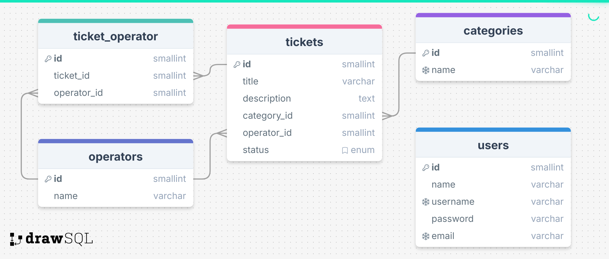

# full-stack-ticket-platform
questa repo consiste nella creazione di un app utilizzando Laravel per un ipotetica gestione per supporto clientela.
Questo progetto fa parte della serie di esercizi consegnati nel coding training offerto da Boolean.
Il coding training consiste in un incontro alla settimana post-corso in cui per tenersi in allenamento con il codice vengono proposti esercizi per tenersi allenati nella programmazione, ma anche nell'esposizione del contenuto di fronte ad altri studenti, in un ambiente molto stimolante. 
Qui di sotto è riportata la consegna.   


## consegna
<aside>
📚 📑  
Realizziamo un’applicazione in Laravel che visualizza e permette di gestire e visualizzare dei **Ticket di supporto**.

E’ prevista una sola tipologia di utente: un Admin che ha accesso alla lista degli operatori, dei ticket e delle relative categorie assegnabili.

Sui ticket sono possibili le seguenti operazioni: creazione, aggiornamento dello stato e assegnazione ad un operatore. Un ticket deve essere obbligatoriamente assegnato ad un operatore **disponibile** in fase di creazione.

Per questa fase non è prevista alcuna visualizzazione avanzata dei ticket se non una semplice lista. Tutte le operazioni vengono svolte all’interno di un unico backoffice a disposizione dell’Admin.

- **Milestones**
    
    1️⃣ **Milestone 1**
    Sviluppare un diagramma ER per le entità e le relazioni dell’applicativo.
    
    2️⃣ **Milestone 2**
    Seguendo il diagramma creato nella prima milestone, creiamo e popoliamo il database attraverso migrations e seeders (si consiglia l’uso dei Faker per popolare le risorse).
    Teniamo presente che una entità Ticket dovrà avere almeno le seguenti caratteristiche: id, data, stato, titolo, descrizione e inoltre dovrà avere una categoria, un operatore e uno stato (ASSEGNATO, IN LAVORAZIONE, CHIUSO).
    
    3️⃣ **Milestone 3**
    Realizziamo un setup dell’applicativo con backoffice e autenticazione riservata ad un unico utente amministratore: l’admin.
    
    4️⃣ **Milestone 4**
    Aggiungiamo la possibilità di creare un nuovo ticket, a cui andrà obbligatoriamente assegnata anche una categoria, un operatore e uno stato. In questa fase nella selezione possiamo includere tutti gli operatori.
    
    5️⃣ **Milestone 5**
    Realizziamo una pagina di dettaglio del singolo ticket, con la visualizzazione di tutte le informazioni contenute in esso.
    
    6️⃣ **Milestone 6**
    Aggiungiamo la possibilità di modificare lo stato di un ticket (ad esempio da IN LAVORAZIONE a CHIUSO). Le altre proprietà non possono essere modificate.
    
    ➕ **Bonus 1**
    Nella pagina di listato dei ticket aggiungiamo la possibilità di filtrare i ticket per stato e categoria.
    
    ****➕➕ **Bonus 2**
    In fase di assegnazione di un ticket, aggiungiamo la verifica della disponibilità dell’operatore. Un operatore è occupato quando ha un ticket attivo già assegnato.
    ****
    

📃 **Documentazione, documentazione, documentazione!** 📃

👑 Ogni progetto che si rispetti, ha una presentazione degna del suo nome! 👑

In parallelo allo sviluppo, lavoriamo ad un file readme che **elenchi i requisiti e le funzionalità** del progetto, **commentando e documentando** il ****codice sviluppato nel modo più preciso, ordinato e professionale possibile.

**Attenzione**: la documentazione non è in alcun modo una caratteristica secondaria di un progetto, ma ne è non solo parte integrante, ma **biglietto da visita e presentazione**… 
⬆️ Quindi è veramente fondamentale! ⬆️

</aside>


## esecuzione milestone 

milestone 1:ho sviluppato il diagramma ER tramite drawsql(https://drawsql.app/diagrams).
questa foto rappresenta il database del progetto con le relazioni tra le varie entità.
.
Ho creato quindi una relazione one to many tra categories e tickets e operators e tickets, oltre ad una tabella ponte tra operators e tickets in previsione di gestire il bonus.


milestone 2:Sono partito dunque con la creazione del progetto da zero utilizzando come riferimento il seguente file:
[IKEALARAVEL](./IKEALARAVEL.MD).
Seguendo i passaggi, ottengo così una struttura di base del progetto che ha già una pagina di autenticazione ed una  dashboard.
Parto con la creazione dei Models e vado ad importare le migration create tramite drawsql.
```bash
php artisan make:model Operator
php artisan make:model Category
php artisan make:model Ticket
```
Saranno da creare i seeder per gli operatori.
```bash
php artisan make:seeder OperatorSeeder
php artisan make:seeder CategorySeeder
php artisan make:seeder TicketSeeder
```
Per Operator viene creato un factory per creare in modo casuale i nome degli operatori.
(nel comando da terminale bisogna specificare su quale modello va a lavorare, in questo caso Operator).
```bash
php artisan make:factory OperatorFactory --model=Operator
```
Arrivati a questo punto dopo aver lanciato il comando:
```bash
php artisan migrate:fresh --seed
```
avremo i Model delle tre entità, le migration, i seeder e il database popolato tramite seeder.
Ora che ho i dati pronti vado a creare i controller con il comando da terminale:
```bash
php artisan make:controller OperatorController
php artisan make:controller CategoryController
php artisan make:controller TicketController
```
ed incomincio a scrivere le C.R.U.D. per i controller.
Per quanto riguarda Operator e Category andrò a fare al momento solo una funzione index 
per andare a rappresentare in pagina la lista degli operatori e delle categorie.
Qui c'è l'esempio di come ho scritto la funzione index per operator nel relativo controller:

```php
    public function index(){
        $operators=Operator::all();
        $data=[
            'operators'=>$operators,
        ];

        return view('operator.index', $data);

    }
```
Oltre alla scrittura delle C.R.U.D. creo anche la cartella per le viste delle entità.
(Ricordati che quando accedi ai dati nella vista non accedi direttamente da $data ma dalla chiave che in questo caso sarà $operators). 
L'operazione in sintesi per la costruzione delle viste prevede:
-la scrittura della funzione sul controller che abbia come return la vista relativa
-la scrittura della rotta sul file web.php della rotta
-la creazione del file della vista 

milestone 3: la milestone 3 viene praticamente eseguita nel seguire i passaggi di creazione di [IKEALARAVEL](./IKEALARAVEL.MD).
Vengono aggiunte le viste relative agli index di categories e operators.

milestone 4:
questa milestone prevede la creazione della vista create relativa all'entità ticket e della creazione della funzione store 
nel relativo controller che vada a salvare i dati immessi nel database creando così un nuovo ticket.
Viene quindi fatta la vista create [create-ticket](./resources/views/ticket/create.blade.php) e creato il form che indirizza 
alla funzione store nel controller.
Nel controller[TicketController](./app/Http/Controllers/TicketController.php) scrivo la funzione store che salva i dati nel database e reindirizza alla vista index dei ticket.
Un punto importante che ho imparato in questa milestone è stata la risoluzione del seguente problema:
nella vista index volevo stampare i dati relativi ai ticket ma non riuscivo ad accedere alla colonna name di category nonostante avessi scritto l'operazione.
Chiedendo a Qodo gen diceva che il problema era nel fatto che avessi chiamato la funzione nel model categories invece di category:
[Ticket](./app/Models/Ticket.php)
```php
#esempio sulla funzione funzione per category: come l'avevo scritta 
  public function categories(){
        return $this->belongsTo(Category::class);
    } 
    #... come dovrebbe essere scritta 
      public function category(){
        return $this->belongsTo(Category::class);
    } 
```
ma cambiando solo quella mi dava errore in pagina di undefined relationship.
Stampando tutto il ticket in pagina notavo che mi creava una chiave categories oltre a category_id ma che aveva valore null.
Ho richiesto quindi a qodo gen che perchè con la sua modifica ancora non andava , e giustamente mi fa notare che il nome della funzione che scriviamo nel  model deve essere ripreso nel controller quando uso la funzione with ():
[TicketController](./app/Http/Controllers/TicketController.php)
```php
#come era scritta
    public function index(){
        $tickets=Ticket::with(['categories','operators'])->paginate(8);  #
        $data=[
            'tickets'=>$tickets,
        ];

        return view('ticket.index', $data);

    }

    #come dovrebbe essere scritta:vedere argomenti with
        public function index(){
        $tickets=Ticket::with(['category','operator'])->paginate(8);  #
        $data=[
            'tickets'=>$tickets,
        ];

        return view('ticket.index', $data);

    }
    

```
milestone 5: questo punto consiste nella creazione di una vista show con relativa funzione sul controller per mostrare il dettaglio di un ticket.
Oltre alla vista ed alla funzione nel controller, sarà utile creare un button nella vista index di tickets che rimandi al dettaglio di ogni singolo biglietto.
Attenzione a scrivere nella rotta sul file web che sarà ticket/{ticket} per la show

 milestone 6:creare pagina update per ticket con possibilità di aggiornare solo lo stato del ticket  
 come sempre creare prima la funzione nel controller, poi la rotta su web.php ed infine la vista nella cartella ticket.
 Creare prima vista edit, procedere poi alla funzione update.
 Per la rotta update sarà da strutturare nel seguente modo:
 nel [TicketController](./app/Http/Controllers/TicketController.php) andiamo ad implementare la funzione update.
 In  [web.php](./routes/web.php) andiamo a definire la rotta update .
 ```php
 #patch perchè dobbiamo andare ad aggiornare, e la rotta dovrà avere{ticket} per andare a definire il ticket da modificare 
    Route::patch('/ticket/update/{ticket}',[TicketController::class,'update'])->name('ticket.update');
 ```
Andiamo poi nell'[Index di ticket](./resources/views/ticket/index.blade.php) per creare il collegamento alla relativa pagina edit.